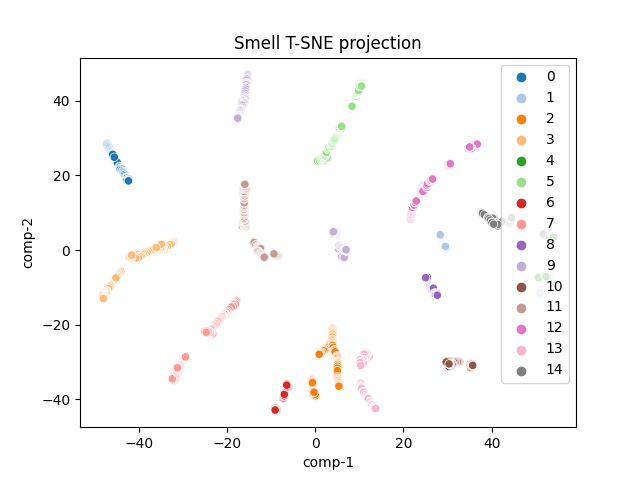

# smell-datasets

Unless otherwise noted, this work is derived from the [Institute for Biomedical Informatics Innovation Core](https://medicine.ai.uky.edu/) at the University of Kentucky.

## Introduction

Electronic nose (e-nose) technology is a type of sensory system that mimics the olfactory system of mammals to detect, identify, and quantify odors or volatile organic compounds (VOCs) in the air.

E-noses consist of a combination of chemical sensors, pattern recognition algorithms, and data analysis software that work together to identify and classify different smells. The chemical sensors used in e-noses can detect a wide range of VOCs, including gases such as carbon dioxide, nitrogen oxides, and methane, as well as volatile organic compounds like benzene, formaldehyde, and ethanol.

E-noses can be used in a variety of applications, including food and beverage quality control, environmental monitoring, medical diagnosis, and detection of hazardous chemicals. In the food industry, e-noses are used to ensure product consistency and to detect contaminants or spoilage. In medical applications, e-noses have been used to detect diseases such as lung cancer and diabetes by analyzing the volatile organic compounds in patients' breath. In environmental monitoring, e-noses can detect and identify pollutants in the air, water, and soil.

This repository provides measurement data, data parsers, data visualization, and pretrained models for e-nose applications.

## Raw Data
Raw data is obtained from the [smell.Inspector device using smell.Annotator software](https://smart-nanotubes.com/products/#hardware)

Raw measurements from the Smell Annotator are found in the "raw_data" directory.

Currently, there are 15 different smells, each with multiple samples.

## Dataset Parser
The dataset parser combines the raw files, eliminates unused channels, and prepares a dataset for model training.

Output support has been added to product timeseries datasets.
```
python dataset_gen.py 
```

### Data Visualization
The dataset visualization code implements t-distributed stochastic neighbor embedding (t-SNE) and plots information on a scatter plot.
```
python visual_gen.py 
```


```
{
    "0": "ambient air",
    "1": "ambient room",
    "2": "cocacola",
    "3": "cocacola cold",
    "4": "dasani water",
    "5": "dasani water cold",
    "6": "motts applejuice",
    "7": "motts applejuice cold",
    "8": "pureleaf sweettea",
    "9": "pureleaf sweettea cold",
    "10": "redbull",
    "11": "redbull cold",
    "12": "starbucks dark coffee cold",
    "13": "starbucks dark roast coffee",
    "14": "starbucks dark roast coffee hot"
    
}
```

## Models 
Pretrained models trained across 15 classes can be found in the "models" directory

| Model |      AUC      | ACC | Best Score |
|:-------:|:---------------------------------:|:------:|:-------:|
|   Random Forest   |          1           | .99 |   .98   |
|   Neural Network  |               1              | 1 |   .98   |
|   Logistic Regression   | 1 |  .99 |   .77   |


## Model Training
[Using ml_classifier_trainer](https://github.com/innovationcore/ml_classifier_trainer)
```
python main.py --dataset_path=smell_dataset.csv --multiclass
```